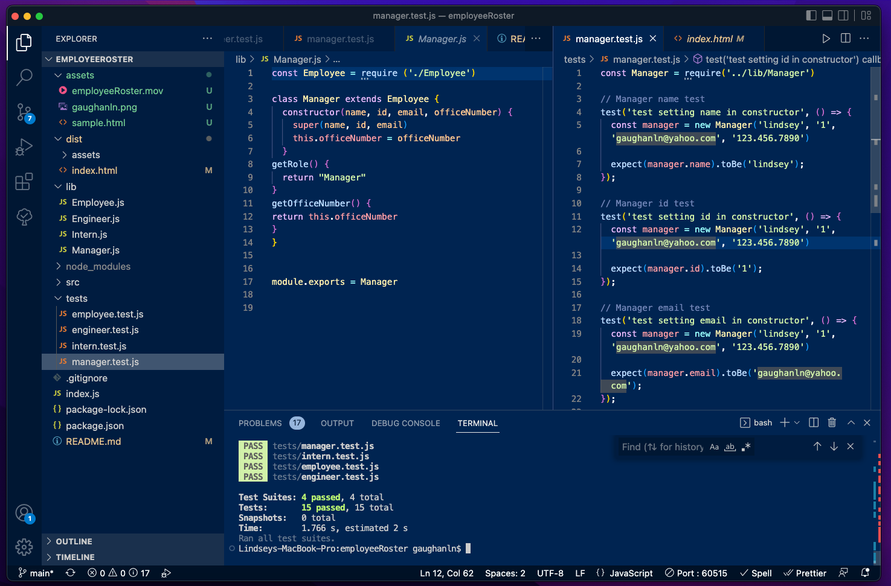
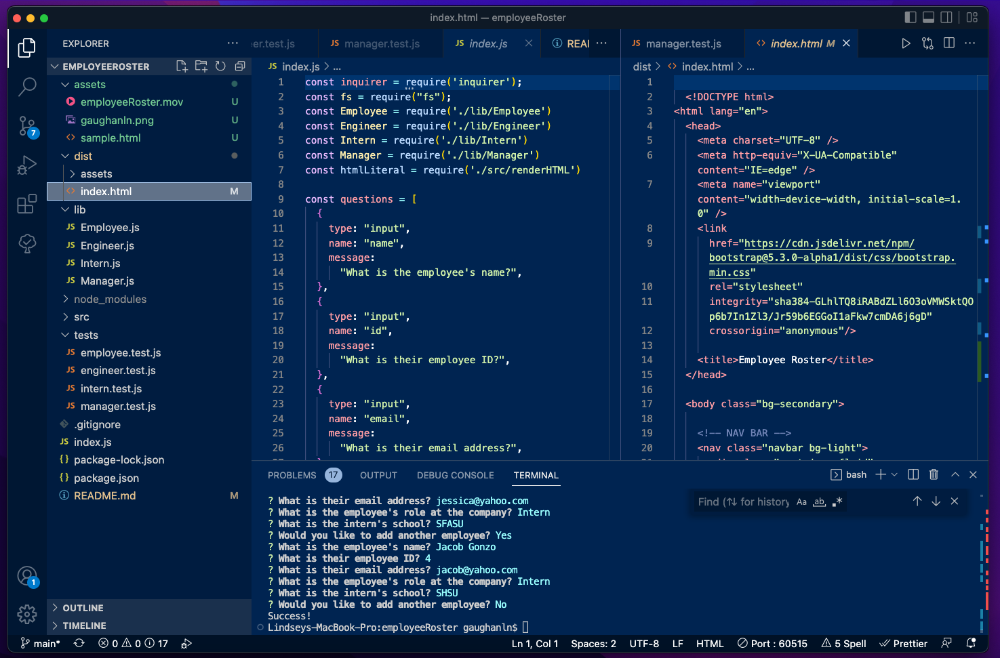
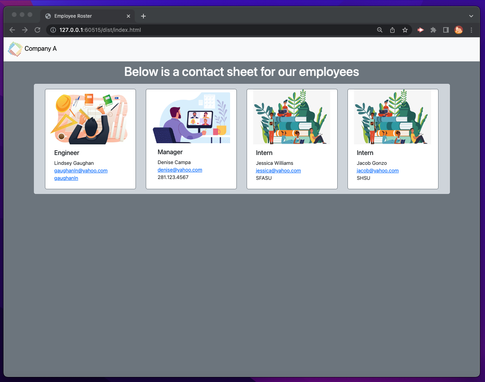

# Employee Roster 

## Description

This application will gather employee information and generate and html document showing the results.

## Criteria:

* A command-line application that prompts the user with an array of questions about employees and accepts the user input 
* Tests on each employee to ensure data accuracy
* Use of Inquirer 8.2.4 + Jest
* Each team member will have one different identifier: Manager = Office number, Engineer = Github and Intern = School
* Github and email must link / open up a new email
* Can input as many employees as necessary 
* Once team is complete, an html document is created showing all the employees with their respective information. 

<!-- Video of application in progress -->
## End Product 
Below is a video of the application in use 

https://user-images.githubusercontent.com/111533986/217568871-0b27c970-6a4e-4ef8-9a2d-628293e7e436.mov

<!-- screenshots -->
Below are screenshots of the application in use

<!-- link -->
## Deployment
Here is the [link](https://github.com/gaughanln/employeeRoster) to the Github repo

## Contributing
Lindsey Gaughan (Me!) 

